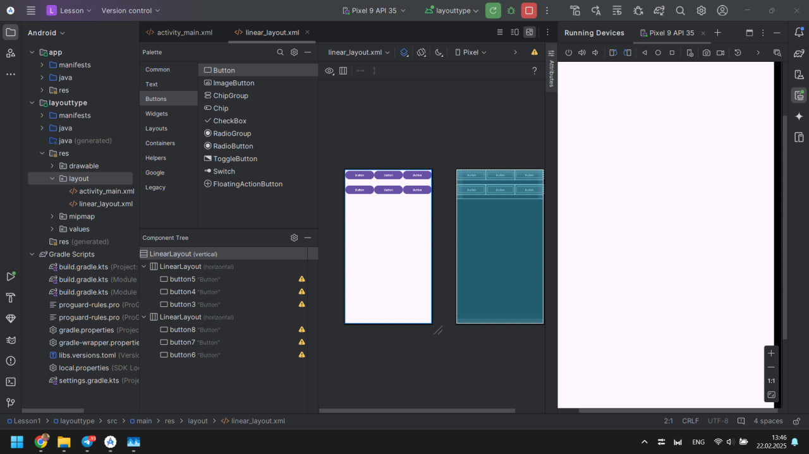
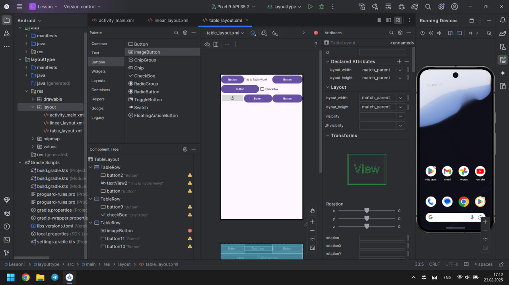
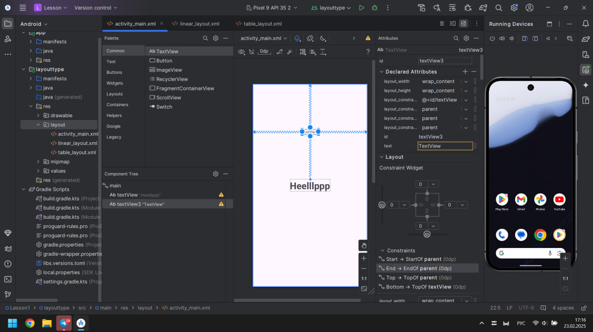
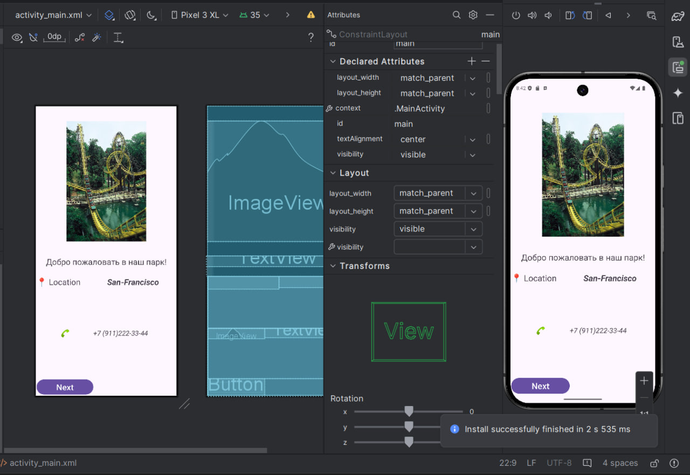

1. Контрольное задание: Изучить атрибуты макетов «ViewGroup» и для каждого типа создать свой Layout

1.1. LinearLayout:

1.2. TableLayout:

1.3. ConstraintLayout:

2. Задание: требуется создать собственный экран с использованием изученных элементов.

