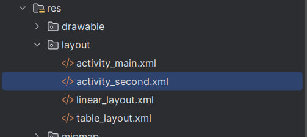

1. Контрольное задание: Изучить атрибуты макетов «ViewGroup» и для каждого типа создать свой Layout

1.1. LinearLayout:

1.2. TableLayout:

1.3. ConstraintLayout:

2. Задание: требуется создать собственный экран с использованием изученных элементов.

5.2. Задание: Создать layout-файл «activity_second.xml».

5.4 Задание: Требуется открыть файл activity_second.xml (land) и изменить расположение кнопок так, чтобы все из них были отображены.

Было:

Стало:

Открыть модуль «control_lesson1». Добавить горизонтальную разметку. 

6. Обращение из кода к элементам экрана:

7.1 Требуется создать новый модуль. В меню «File>New>New Module>Phone & Tablet Module>Empty Activity». Название проекта «ButtonClicker».
Требуется, чтобы по нажатию кнопки менялось содержимое «TextView». По нажатию кнопки «WhoAmI» – выводится текст: «Мой номер по списку №11», по нажатию « ItIsNotMe» – «Это не я сделал».

7.2 Создайте обработчик события для кнопки «btnItIsNotMe» вторым способом. Добавьте элемент «CheckBox» изменяющий свое состояние при нажатии на кнопки вместе «TextView».

