1. Создайте модуль «ActivityLifecycle». В созданном классе изначально присутствует реализация только метода «onCreate». Требуется переопределить основные методы жизненного цикла родительского класса, рассмотренные выше. Для создания метода возможно произвести ввод названия метода, среда разработки
отобразит всплывающее меню с доступными методами.

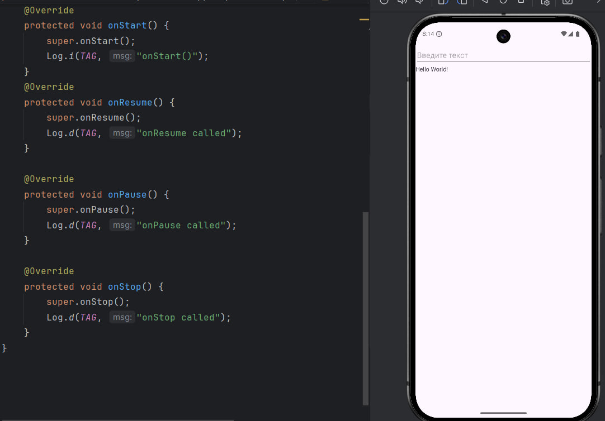

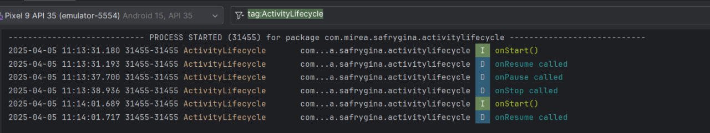

Вопросы:
1. Будет ли вызван метод «onCreate» после нажатия на кнопку «Home» и возврата в приложение?

2. Изменится ли значение поля «EditText» после нажатия на кнопку «Home» и возврата в приложение?

3. Изменится ли значение поля «EditText» после нажатия на кнопку «Back» и возврата в приложение?

Задание 3.4 Создать новый модуль. В меню «File | New | New Module | Phone & Tablet Module | Empty Views Activity». Название проекта «MultiActivity». 
В разметке activity_main.xml требуется добавить кнопку и реализовать обработчик нажатия на кнопку: 

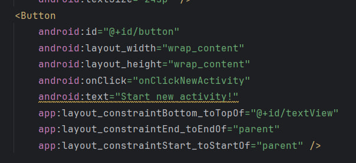

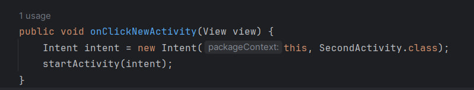

Требуется в первую «activity» добавить поле ввода и кнопку «Отправить». На второй «activity» требуется отобразить значение поля первой активности в «TextView».

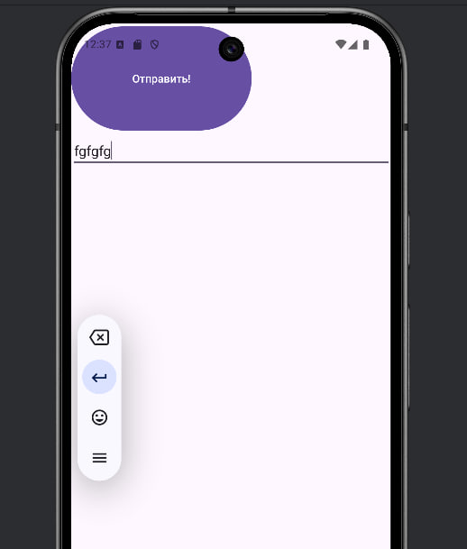

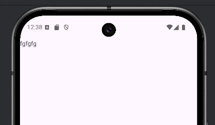

Требуется переопределить основные методы жизненного цикла у обеих «Activity».

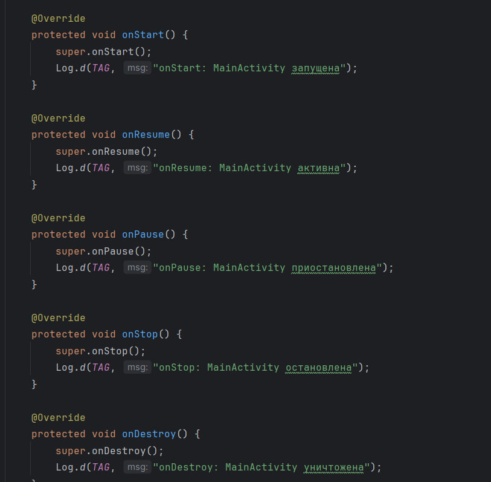

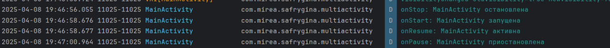

Создать новый модуль. В меню «File | New | New Module | Phone & Tablet Module | Empty Views Activity». Название проекта «IntentFilter». 
Требуется добавить в разметку «activity_main.xml» одну кнопку и обработчик нажатия для вызова веб-браузера. Добавить дополнительную кнопку для передачи ФИО студента и университета в другое приложение.
При нажатии на кнопку для вызова веб-браузера открывается сайте mirea.ru, но наш эмулятор не выдержить такой нагрузки, как загрузки веб-браузера((
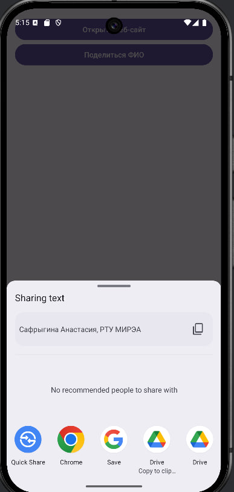

При нажатии на дополнительную кнопку, появляется возможность поделиться нашим фио и университетом:
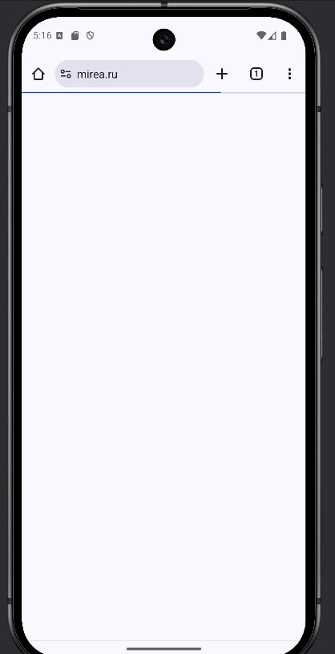

Создать новый модуль. В меню «File | New | New Module | Phone & Tablet Module | Empty Views Activity». Название модуля «ToastApp». Добавить поле ввода и кнопку.
Требуется подсчитать количество символов в поле ввода и отобразить сообщение «Toast» «СТУДЕНТ № Х ГРУППА Х Количество символов - Х». 

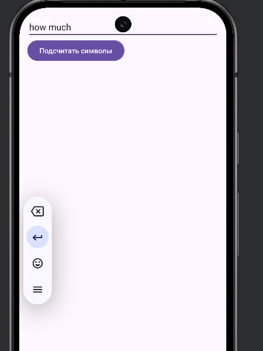

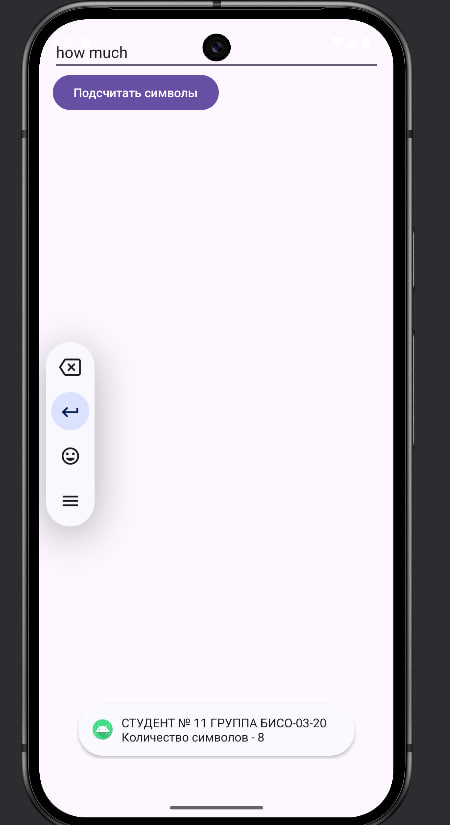

Создать новый модуль. В меню «File | New | New Module | Phone & Tablet Module | Empty Views Activity». Название проекта «NotificationApp». 

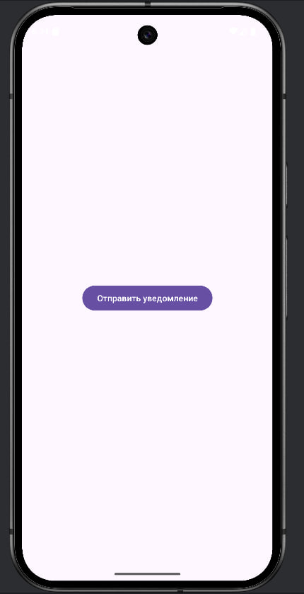

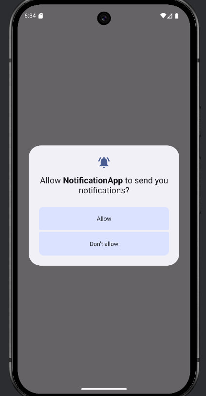

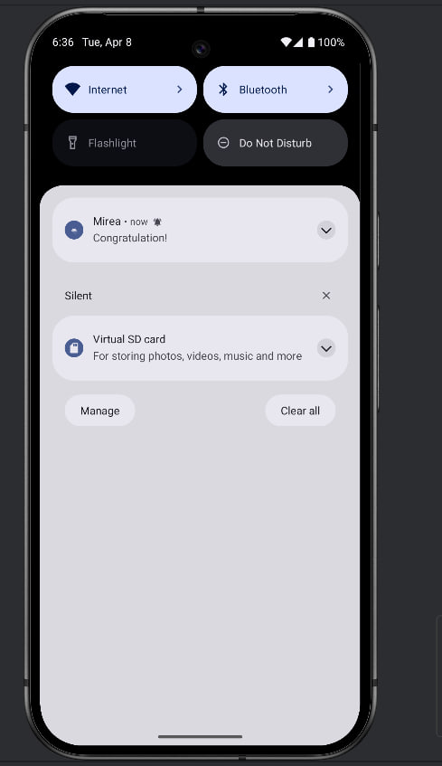

Создать новый модуль. В меню «File | New | New Module | Phone & Tablet Module | Empty Views Activity». Название модуля Dialog. 
После запуска проекта, скорее всего, отобразится пустой прямоугольник или квадрат, либо потемнеет экран активности. Таким образом был получен пустой фрагмент. 

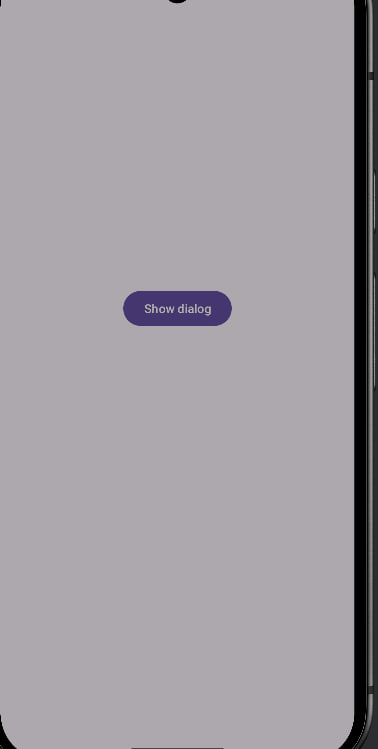

Следующий этап – это его конструирование. Результатом выполнения кода является диалоговое окно, внешний вид которой представлен на рисунке ниже

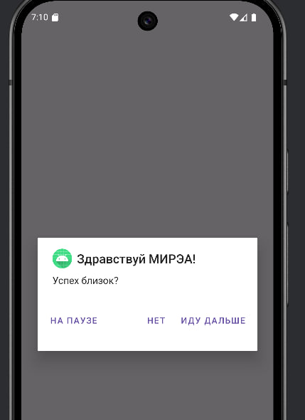
