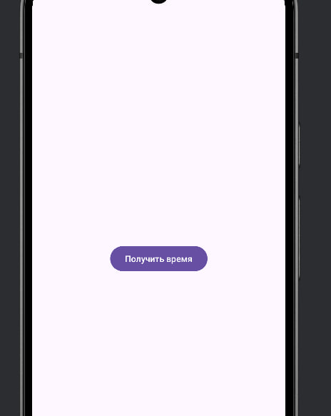
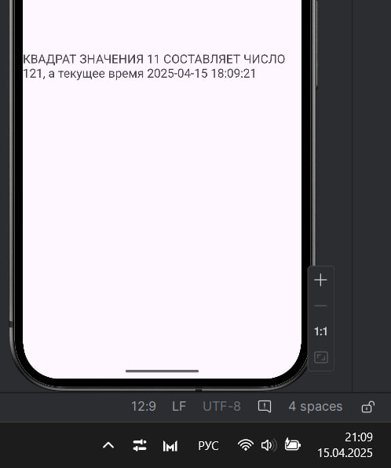
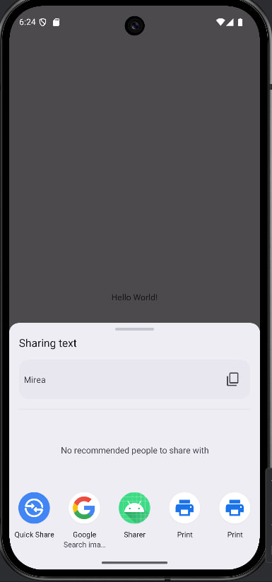
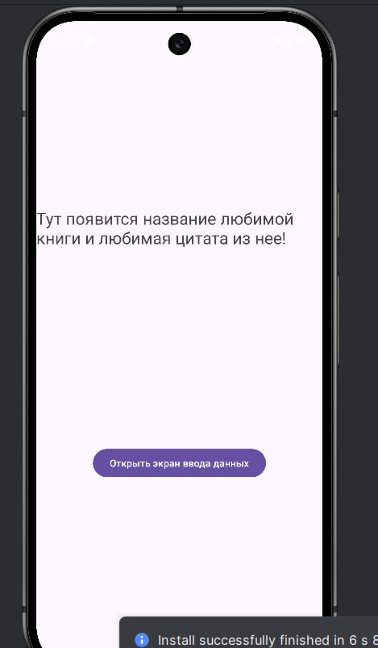
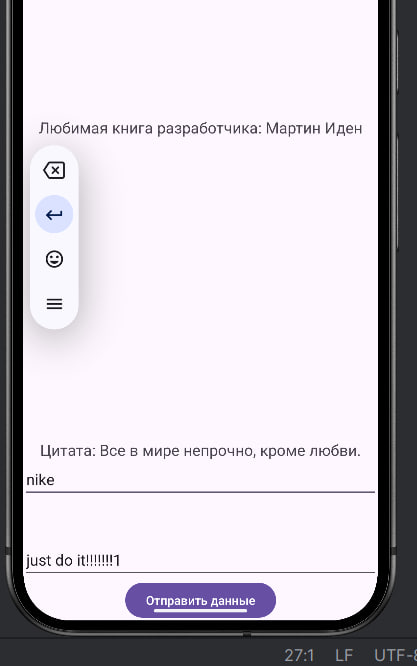
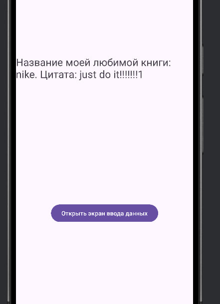
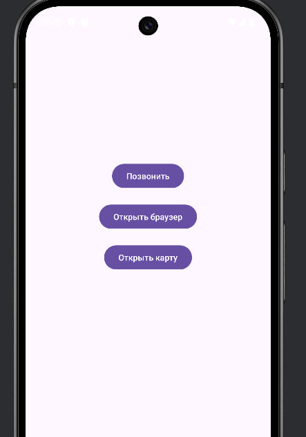
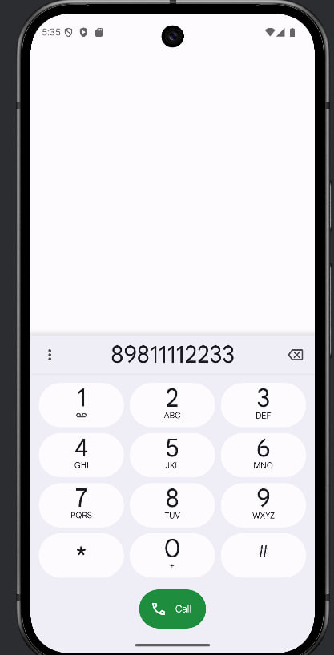
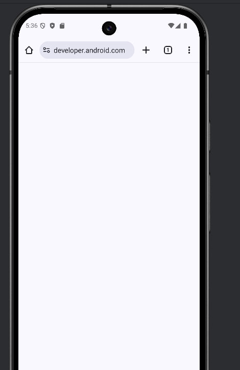
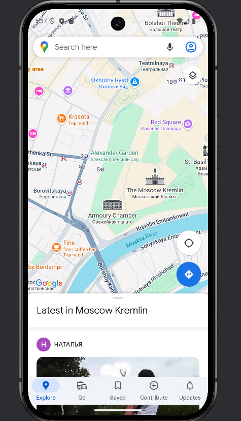

### 1. Создайте модуль «IntentApp». 
Создайте 2 activity. Проверьте наличие записи о новом активности в manifest - файле. В первой активности требуется получить системное время Далее требуется передать время из одной активности в другую и отобразить во второй activity в «textView» следующую строку: «КВАДРАТ ЗНАЧЕНИЯ МОЕГО НОМЕРА ПО СПИСКУ В ГРУППЕ (11) СОСТАВЛЯЕТ ЧИСЛО, а текущее время ВРЕМЯ».

### 2. Создайте модуль «Sharer». 

### 3. Создать новый модуль «FavoriteBook».
Создать приложение с двумя экранами. Основное предназначение приложения заключается в отображении на экране названия любимой книги разработчика и пользователя приложением с использованием двух активностей

### 3. Создать новый модуль «SystemIntentsApp».
Требуется создать приложение, позволяющее отображать:
- страницу web - ресурса;
- координаты на карте;
- окно набора номера.

