0. [Первый проект]()
1. [Второй проект]()
## Первый проект "Lesson4"

Убедимся, что файл «ActivityMainBinding» успешно сгенерировался:
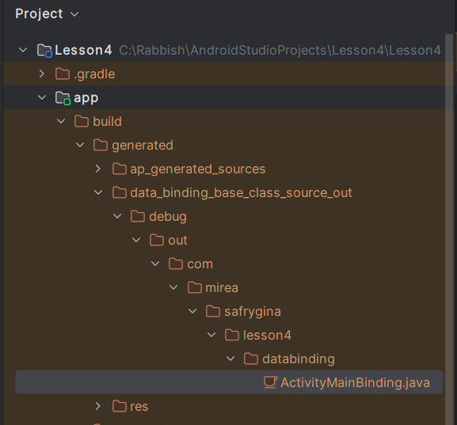

### 1. Создайте экран музыкального плеера с использованием «binding» для горизонтальной и портретной ориентации.
Для начала скопируем пример из методички и попробуем его запустить:
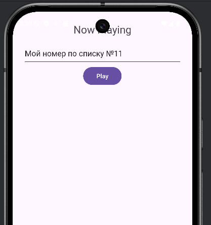

Создадим сам плеер с горизонтальной и портретной ориентацией:
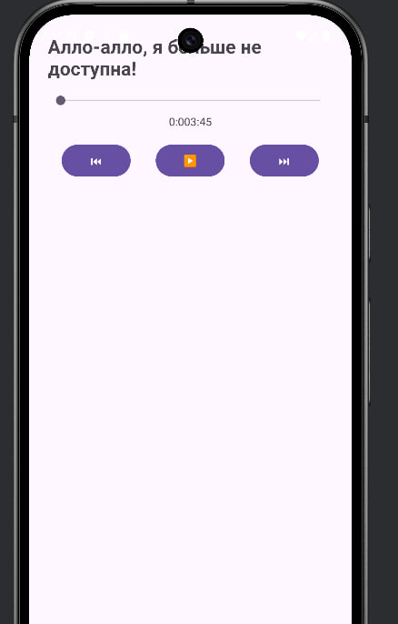
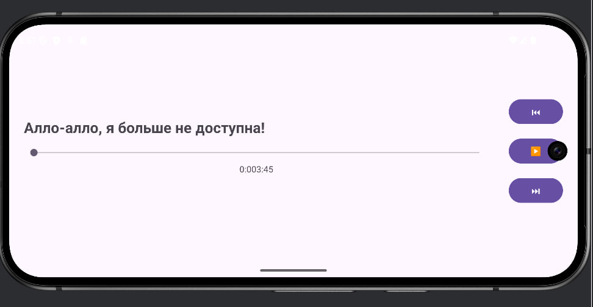

### 2. Создайте модуль «thread». 
На экране требуется разместить элементы «Button» и «TextView». Инициализацию графических компонентов осуществить с помощью «Binding».
Посчитать в фоновом потоке среднее количество пар в день за период одного месяца. Общее количество пар и учебных дней вводятся в главном экране.
Отобразить результат в «TextView»

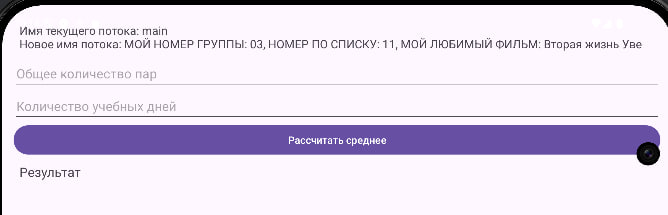
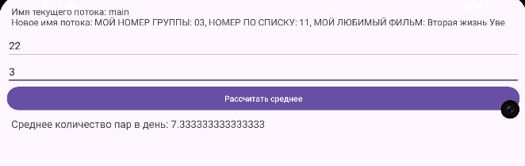
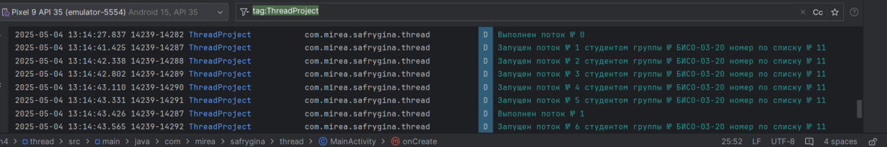

### 3. Создать новый модуль «data_thread».
Требуется определить в какой последовательности происходит запуск процессов. Изучите методы «runOnUiThread», «postDelayed», «post». В «TextViwe» описать в чём различия между элементами и последовательность запуска.

Установим максимальное количество строк 10 и поймем, что видно не весь текст:
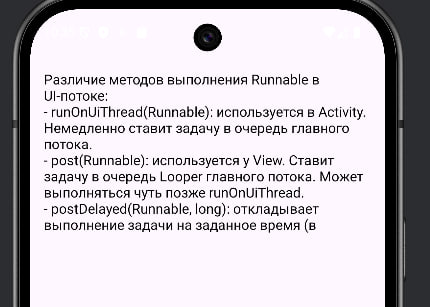
Увеличим максимальное количество строк до 20 и пересоберем проект:
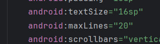
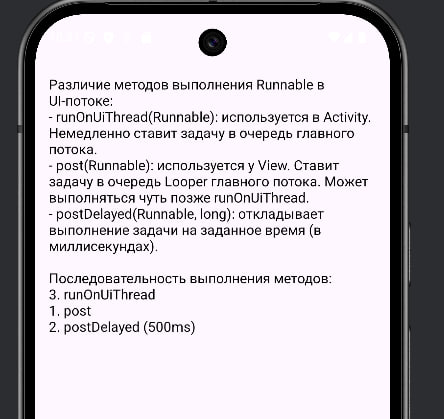

### 4. Создать новый модуль «looper».
В main_activity.xml требуется добавить «button» и реализовать обработку нажатия. Реализуйте пример, в котором вводится Ваш возраст и кем Вы работаете. Количество лет соответствует времени задержки. Результат вычисления осуществлять через Log.d.

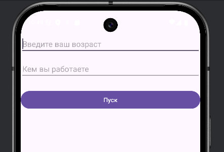
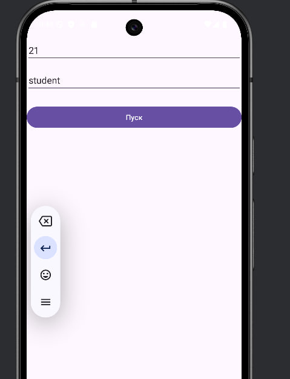
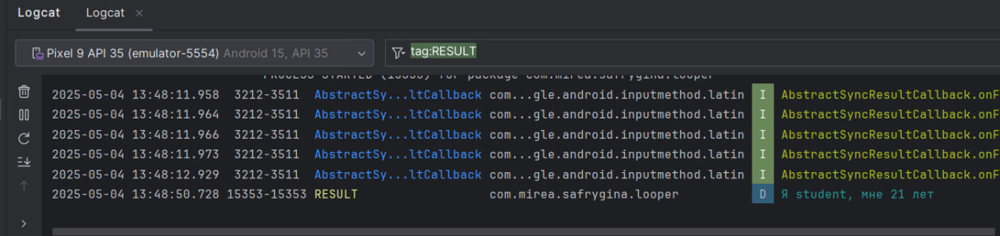

### 5. Создать новый модуль «CryptoLoader».
В созданном модуле требуется добавить элементы «EditText» и «Button». Пользователь вводит фразу в «EditText», далее она шифруется с помощью алгоритма AES и передается вместе с ключом в «Loader». В «Loader» происходит дешифровка фразы и последующая передача в «MainActivity». Дешифрованная фраза отображается с помощью «toast» или «snackBar»

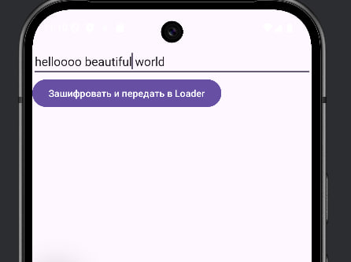
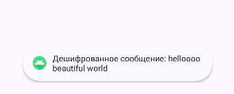

### 6. Создать новый модуль «ServiceApp».

Требуется добавить функционал воспроизведения аудиофайла. В первую очередь необходимо добавить медиа файл (типа «.mp3» и т.д.) в ресурсы. В активности добавить две кнопки «button» для воспроизведения и остановки музыкальных композиций/композиции. Придумать собственный дизайн данного проигрывателя
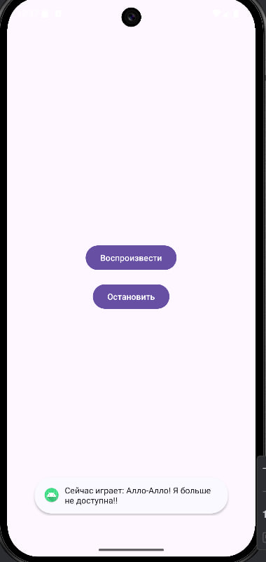
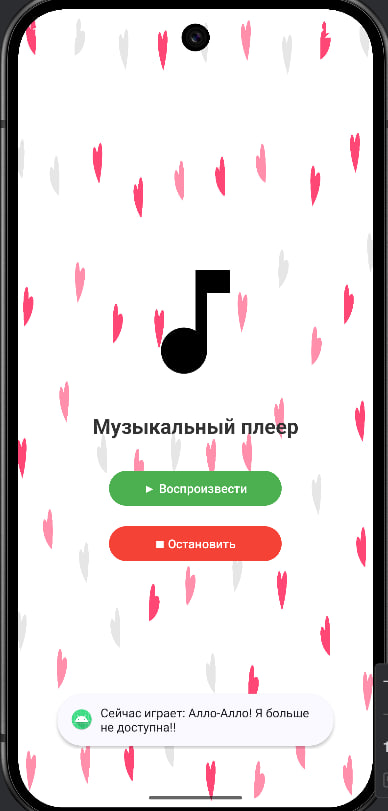

### 7. Создать новый модуль«WorkManager».
Добавить в пример критерии запуска: напр. наличие интернета.

## Второй проект "MireaProject"
### В проекте «MireaProject» создать отдельный фрагмент выполнения фоновой задачи 
и реализовать её выполнение с помощью применения механизма «Worker», либо одной из разновидностей сервисов. 

