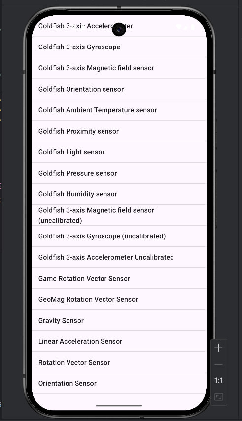
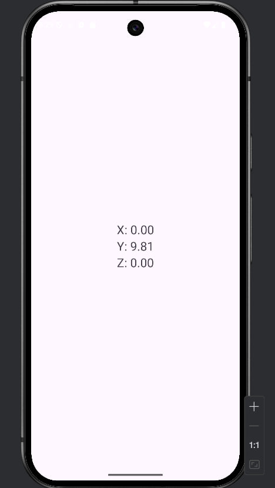
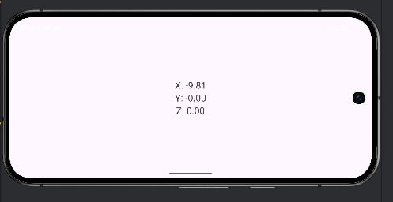
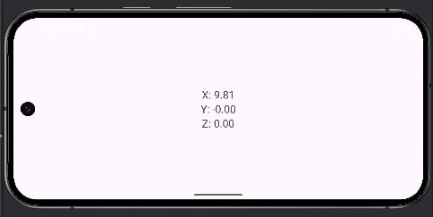
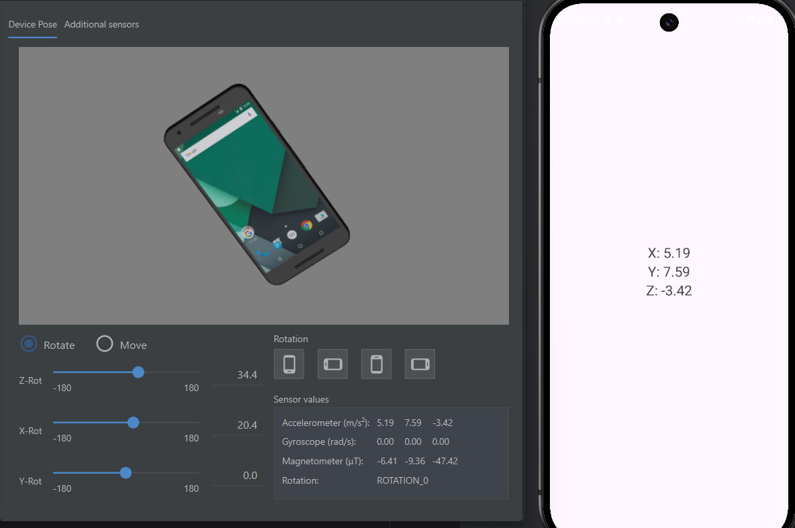
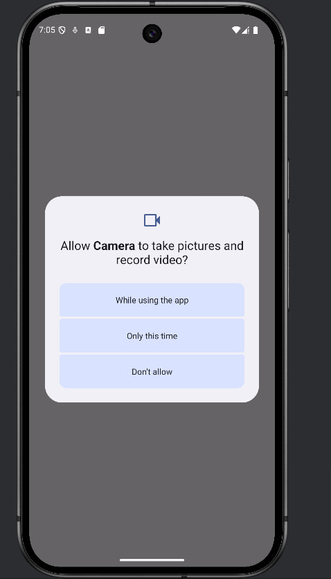
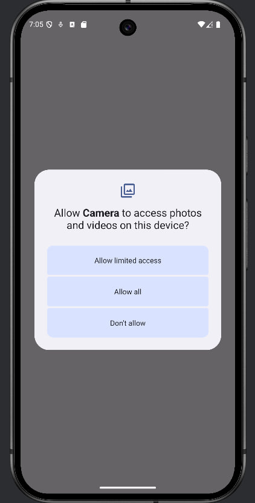
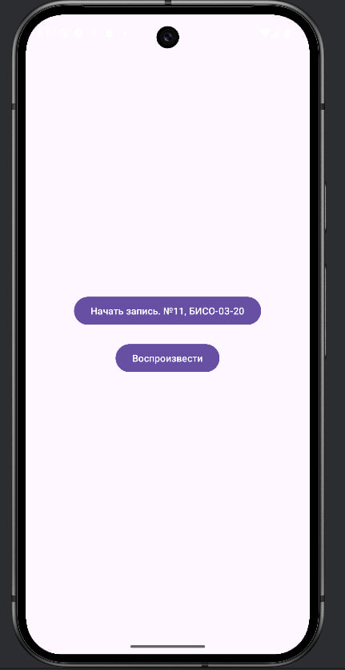
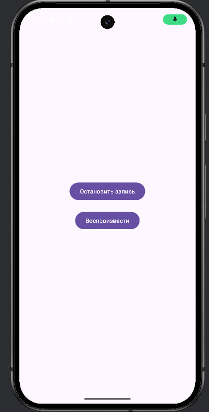
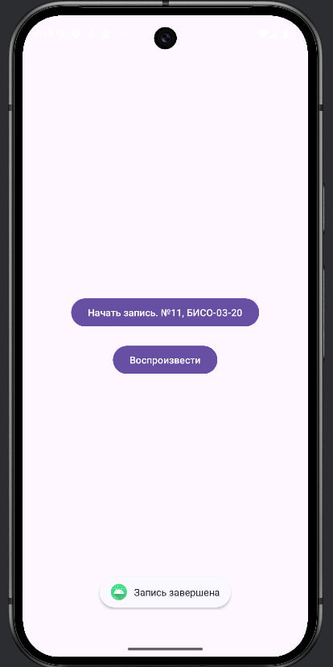

0. [Первый проект]()
1. [Второй проект]()

## Первый проект "Lesson5"

### 1. Отобразить в виде списка датчиковое оборудование на устройстве.

### 2. Создать новый модуль «Accelerometer». 
Требуется создать приложение, отображающее значения акселерометра на главном экране. При вращении устройства значения должны изменяться на главном экране

### 3. Создать новый модуль «Camera». 
Возможности приложения: вызов системного приложения «камера», сохранение изображения в папку приложения и отображение снимка на экране. В «activity_main» требуется добавить «image_view» и реализовать обработчик нажатия с помощью «ViewBinding». 

### 4. Создать новый модуль «AudioRecord».
Требуется разработать приложение для работы с диктофоном, позволяющее записывать аудио и его воспроизводить

## Второй проект "MireaProject"
### В проекте «MireaProject» создать отдельный фрагмент выполнения фоновой задачи и реализовать её выполнение с помощью применения механизма «Worker», либо одной из разновидностей сервисов. 
- добавить в приложение механизмы запроса разрешений;
- экран, в котором используется результат с любого из имеющегося датчика для решения какой-либо задачи логической задачи (определение направления на север на экране про определение севера по солнцу, мху и т.д.; влияние высоты гор на организм и т.д.);
- экран, в котором используется результат приложения «камера» для решения какой-либо «творческой» задачи (создание коллажа, заметки, профиля и т.д.);
- экран, в котором используется функционал микрофона для решения какой-либо задачи.
