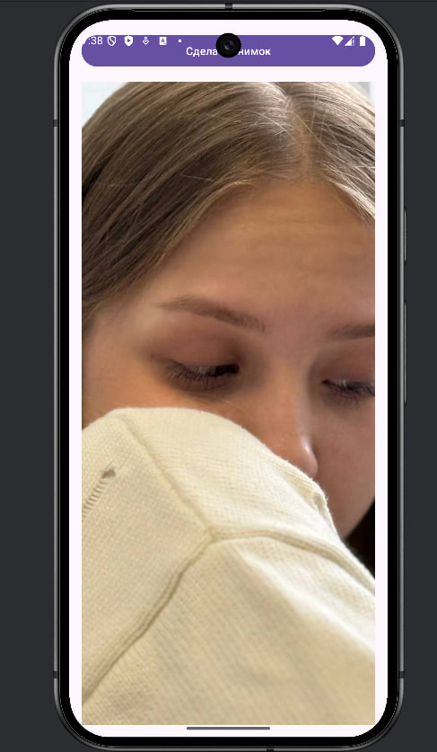

0. [Первый проект]()
1. [Второй проект]()

## Первый проект "Lesson5"

### 1. Отобразить в виде списка датчиковое оборудование на устройстве.

### 2. Создать новый модуль «Accelerometer». 
Требуется создать приложение, отображающее значения акселерометра на главном экране. При вращении устройства значения должны изменяться на главном экране

### 3. Создать новый модуль «Camera». 
Возможности приложения: вызов системного приложения «камера», сохранение изображения в папку приложения и отображение снимка на экране. В «activity_main» требуется добавить «image_view» и реализовать обработчик нажатия с помощью «ViewBinding». 

### 4. Создать новый модуль «».

### 5. Создать новый модуль «».
В созданном модуле требуется добавить элементы «EditText» и «Button». Пользователь вводит фразу в «EditText», далее она шифруется с помощью алгоритма AES и передается вместе с ключом в «Loader». В «Loader» происходит дешифровка фразы и последующая передача в «MainActivity». Дешифрованная фраза отображается с помощью «toast» или «snackBar»

### 6. Создать новый модуль «».

### 7. Создать новый модуль«».

## Второй проект "MireaProject"
### В проекте «MireaProject» создать отдельный фрагмент выполнения фоновой задачи и реализовать её выполнение с помощью применения механизма «Worker», либо одной из разновидностей сервисов. 

Скопируем проект из Lesson3 и добавим к нему новый фрагмент WorkerFragment:

Проверим отображение фоновой задачи в LogCat и увидим, что все работает:

