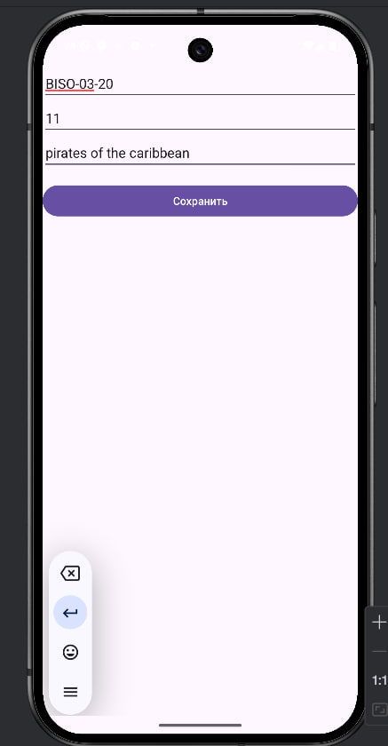

0. [Первый проект]()
1. [Второй проект]()

## Первый проект "Lesson6"

### 1. На экране необходимо разместить три поля ввода, и кнопку для сохранения информации.
Требуется запомнить номер группы, номер по списку и название любимого фильма или сериала с помощью «getSharedPreferences». После новой загрузки приложения в поле ввода должны отобразиться значения из памяти. Для ВЫПОЛНЕНИЯ ЗАДАНИЯ требуется:
- найти файл настроек с помощью «Device Explorer» в среде разработки «Android Studio»;
- открыть файл настроек;
- создать директорию «raw» в проекте;
- сделать скриншот экрана со значениями файла и разместить его в директории «raw».

Введём необходимые данные и нажмем кнопку сохранить:

Найдём файл настроек, сделаем скриншот и добавим в директорию raw:

Перезапустим приложением и увидим, что зачения отображаются из памяти

### 2. Создать новый модуль «SecureSharedPreferences». 
Требуется создать экран отображения имени Вашего любимого поэта и его фотографии или рисунка

### 3. Создать новый модуль «InternalFileStorage». 
Для ВЫПОЛНЕНИЯ ЗАДАНИЯ требуется:
- добавить на экран поле ввода и кнопку;
- записать в файл памятную дату в истории России и ее описание;
- создать директорию «raw» в проекте;
- переместить созданный файл с эмулятора или устройства в проект

Добавим памятную дату - отмену крепостного права и нажмем кнопку сохранить:

Переместим созданный файл в директорию raw:

### 4. Создать новый модуль «Notebook».
Требуется создать приложение – «Блокнот» с сохранением файлов. Для ВЫПОЛНЕНИЯ ЗАДАНИЯ требуется:
- добавить на экран поля ввода «названия файла» и «цитата»;
- добавить на экран кнопки «сохранить данные в файл» и «загрузить данные из файла»;
- файлы сохраняются в публичную директорию «Directory_Documents» с перезаписью;
- при загрузке файла считываются данные и устанавливаются в поле «цитата»;
- требуется записать в два файла цитаты известных людей;
- создать директорию «raw» в проекте;
- переместить созданные файлы с эмулятора или устройства в проект.

Сохраним два файла с цитатами:

Попробуем загрузить данные из одного файла:

Найдем два новых созданных файла и переместим их в директорию raw в проект:

## Второй проект "MireaProject"
### В контрольном задании «MireaProject» 
- добавить фрагмент «Профиль», в котором пользователь должен указать определённые параметры (задумка исполнителя) и сохранить их в«SharedPreferences»;
- добавить фрагмент «Работа с файлами». Придумать функционал экрана, связанный с обработкой файлов (конвертация форматов, криптография, стеганография и т.д.). При нажатии на «Floating Action Button» вызывается диалоговое окно/фрагмент/View создания записи

