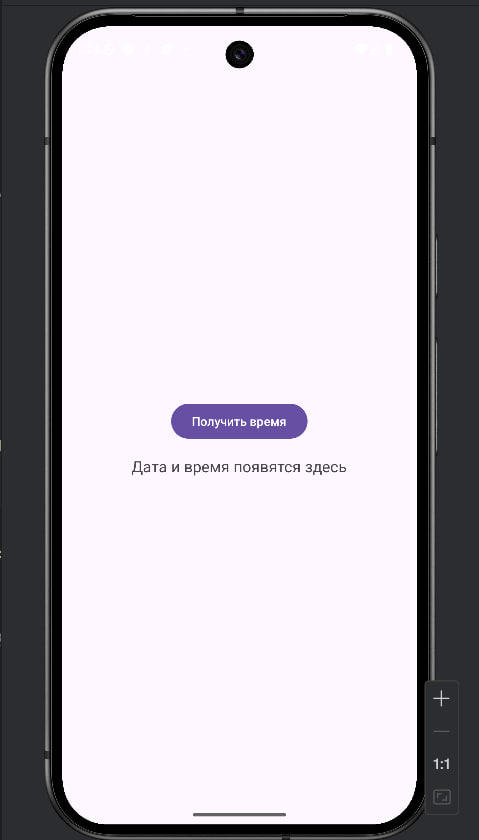
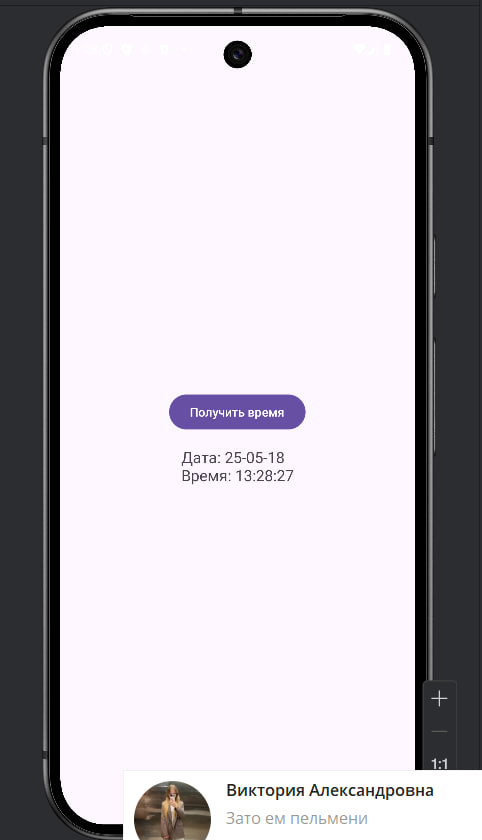
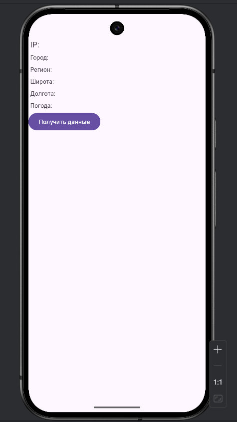
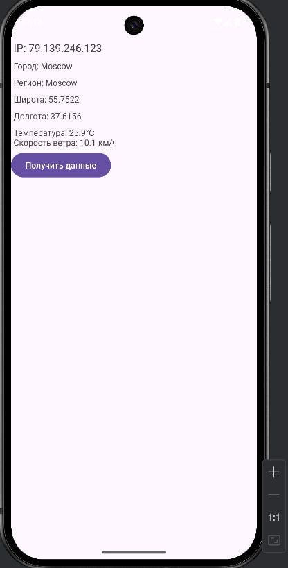
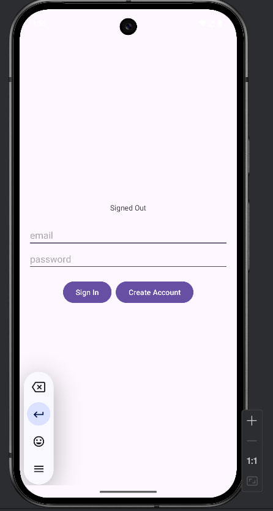
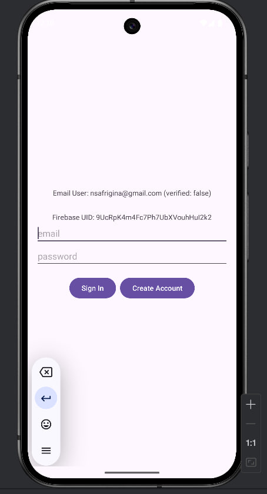
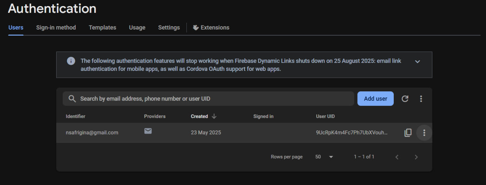
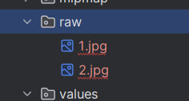

0. [Первый проект]()
1. [Второй проект]()

## Первый проект "Lesson7"

### 1. Создать новый модуль «TimeService». 
Для ВЫПОЛНЕНИЯ ЗАДАНИЯ требуется разобрать полученную строку и создать экран отображения времени и даты.

### 2. Создать новый модуль «HttpURLConnection». 
Требуется определить внешний IP-адрес устройства
Для ВЫПОЛНЕНИЯ ЗАДАНИЯ требуется изменить внешний вид экрана для вывода в отдельные текстовые поля значения полей: город, регион и т.д. В примере был представлен механизм извлечения значения ip – адреса из объекта JSON. Полученные координаты требуется передать в сервис погоды «https://api.openmeteo.com/v1/forecast?latitude=52.52&longitude=13.41&current_weather=true» и отобразить погоду на экране

### 3. Создать новый модуль «FirebaseAuth». 
Для ВЫПОЛНЕНИЯ ЗАДАНИЯ требуется реализовать изменение экрана в зависимости от состояния авторизации пользователя в соответствии с рисунком 2.6, а также осуществить вызов методов регистрации, верификации почтового ящика, авторизации и выход из учетной записи по действиям пользователя.
Запустить проект и создать пользователя. Необходимо сделать скриншот зарегистрированного пользователя и консоли разработчика с отображением идентификатора ящика (как на рисунке 2.6). Создать директорию «raw» по адресу «app|src|main|res» и разместить полученный материал.

## Второй проект "MireaProject"
### В контрольном задании «MireaProject» 
Добавить экран входа в приложение с помощью «Firebase» любым способом.
После успешной авторизации произвести переход на главный экран. Добавить фрагмент, отображающий любую информацию из сетевого ресурса. Возможно использование различных способов сетевого взаимодействия (напр. «Retrofit»).

